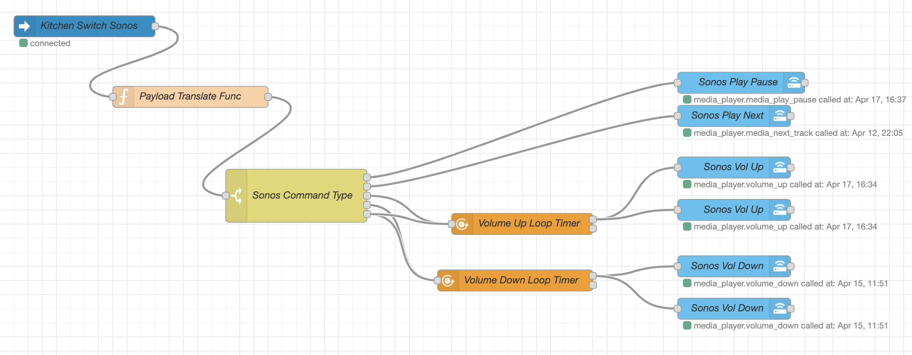

# Flows for Node-RED in Home Assistant
In this repo you can find various code/config examples flows for Node-RED in Home Assistant.

## Sonos & Aqara Switch
Flow source:
[Sonos Switch](flows/sonos-switch.json)

Functionality: 
 - One click: Play/pause current play list/radio
 - Double click: Next (only works with playlist not with radio)
 - Hold: Volume up/down (will alternate between the two)
 
 Flow:
 

